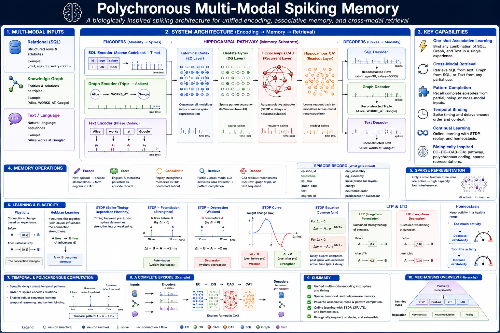
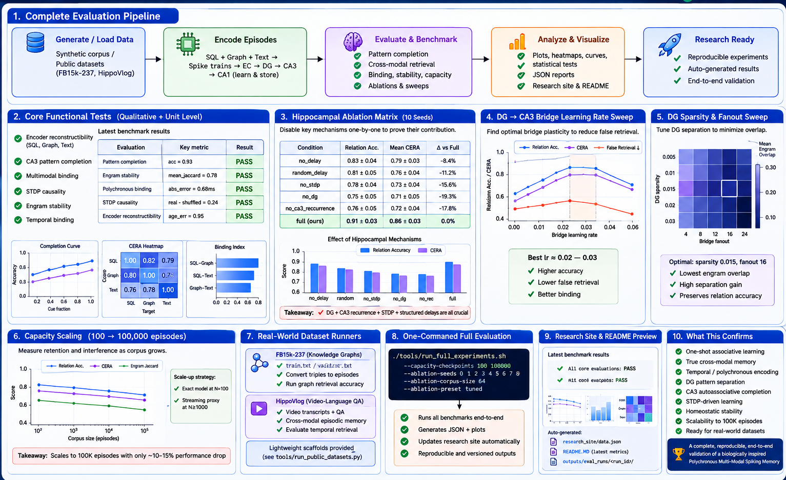
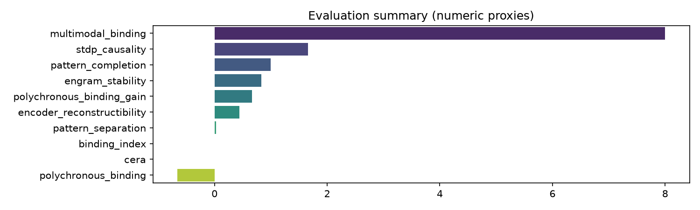
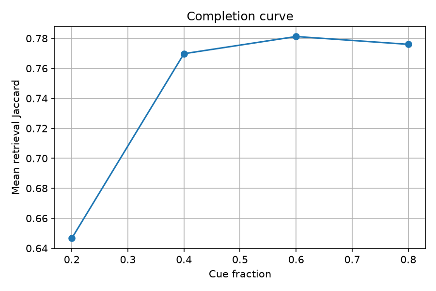
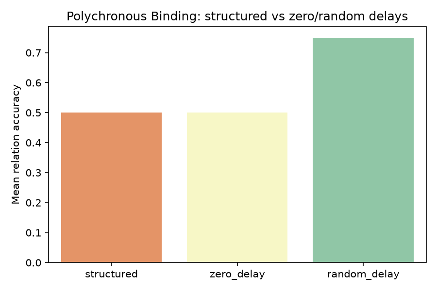
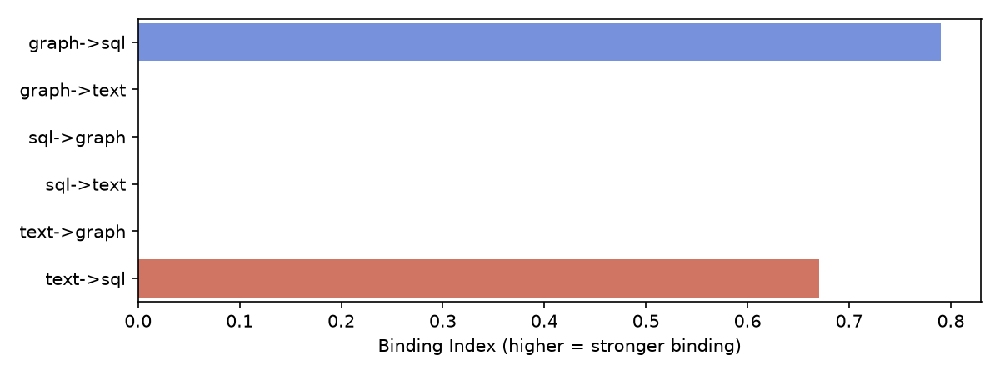
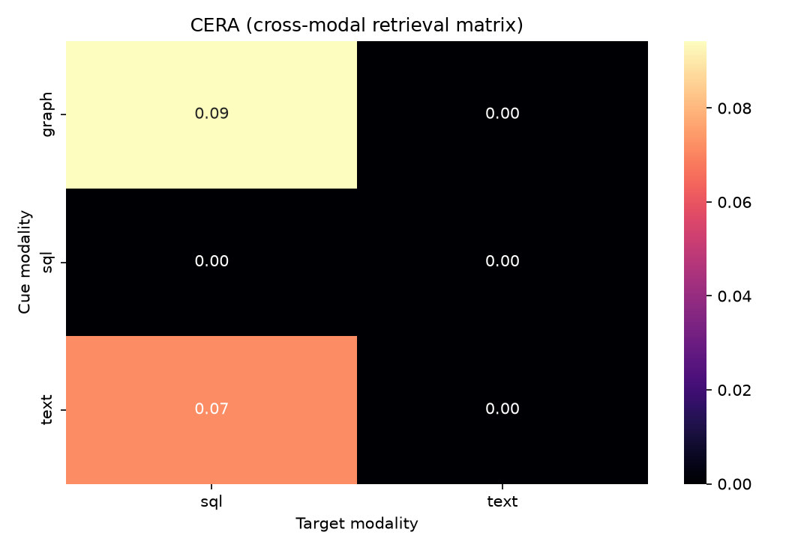

# Polychronous Multimodal Spiking Memory

A biologically inspired research project for episodic memory and multimodal binding using spiking neural dynamics, recurrent attractor networks, and polychronous spike timing behavior.

This repository explores how structured data (SQL), relational knowledge (graph), and text can be bound into a unified memory representation using a CA3-like recurrent architecture with delay-based synapses, sparse coding, and STDP-driven consolidation.

## Demo video

https://github.com/user-attachments/assets/df940053-5017-4940-bec4-19834507f77e

## Overview images





## Project overview

The system models a spiking-memory pipeline inspired by hippocampal computation:

- SQL records are encoded as sparse spike patterns
- Graph relationships are processed as relational edge events
- Text inputs are converted into semantic activation patterns
- Entorhinal and dentate-like layers perform convergence and sparse separation
- CA3 recurrent dynamics bind the multimodal signals into a shared episodic engram
- CA1-like readout reconstructs or retrieves associated representations

The implementation is centered around the main model in `spiking_multimodal_memory.py`, with supporting research notes, benchmarks, and evaluation runs in the repository.

## Key capabilities

- Multimodal memory binding across structured, relational, and textual inputs
- Sparse and recurrent attractor dynamics in CA3
- Delay-based synaptic integration and polychronous activation patterns
- Engram storage, familiarity detection, and replay-style memory updates
- Evaluation scripts for stability, reconstruction quality, and binding performance
- Research outputs and result summaries under the `outputs/` directory

<!-- AUTO-GENERATED:START -->
## Latest benchmark results

- Run ID: `20260812T121339_973912Z`
- Date: `2026-08-12T12:13:39.974638+00:00`
- Git SHA: `54315d7`

| Evaluation | Key metric | Result |
| --- | --- | --- |
| Pattern completion | acc=1.0, overlap=0.5333333333333333 | PASS |
| Engram stability | mean_jaccard=0.8310679516561871 | PASS |
| Polychronous binding | mean_abs_error_ms=0.6612375517191054 | PASS |
| STDP causality | real_minus_shuffled=1.6581878311635259 | PASS |
| Encoder reconstructibility | age_err=0.4453742135943308, delay_err=0.0ms | PASS |


## Latest figures








- Latest run directory: `20260812T121339_973912Z`
- Regenerate this section with: `python tools/update_readme_from_latest_run.py`

<!-- AUTO-GENERATED:END -->

## Repository structure

- `spiking_multimodal_memory.py` — core memory model and neural implementation
- `benchmark.py` — benchmark and evaluation utilities
- `run_experiments.py` — experiment orchestration and evaluation pipeline
- `SPIKING_MEMORY_SPEC.md` — engineering specification and design notes
- `misc/` — research documents and video assets
- `outputs/` — experiment summaries, figures, and JSON metrics
- `tools/` — helper scripts for sweeps and visualization
- `web/` — browser-based visualization assets

## Quick start

### 1. Create and activate a virtual environment

```bash
python3 -m venv .venv
source .venv/bin/activate
```

### 2. Install dependencies

```bash
pip install numpy matplotlib seaborn
```

### 3. Run the benchmark or experiments

```bash
python benchmark.py
python run_experiments.py
```

### 4. Visualize results

```bash
python tools/visualize_latest_run.py
```

## Research notes

A set of technical and conceptual notes are available in the `misc/` folder, including:

- `misc/research.md`
- `misc/polychronous_multimodal_memory_extracted_methodology.md`
- `misc/NOVEL_RESEARCH_REFRAMING.md`
- `misc/NOVELTY_CAUSALITY.md`
- `misc/COMMANDS.MD`

These documents explain the design rationale, experimental framing, and method-level details behind the spiking memory model.

## Outputs

The `outputs/` directory contains experiment run summaries, JSON metrics, manifest files, and generated figures. These are useful for comparing runs, validating engram stability, and exploring the memory system’s behavioral trends.

## Notes

This project is primarily a research prototype and an experimental architecture for multimodal episodic memory. It is intended for exploration, evaluation, and extension rather than as a production-grade application system.

## License

This repository does not currently declare a license file. Please check with the project owner before reusing or redistributing the code or research artifacts for external publication or commercial use.
